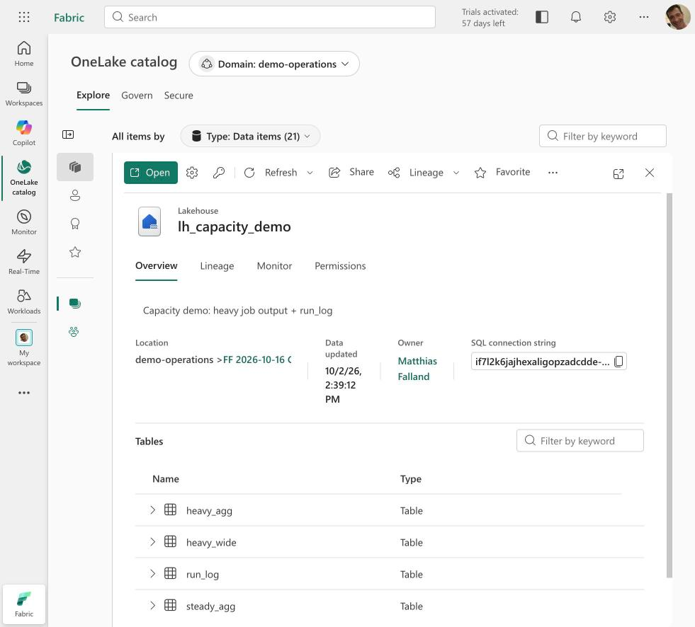
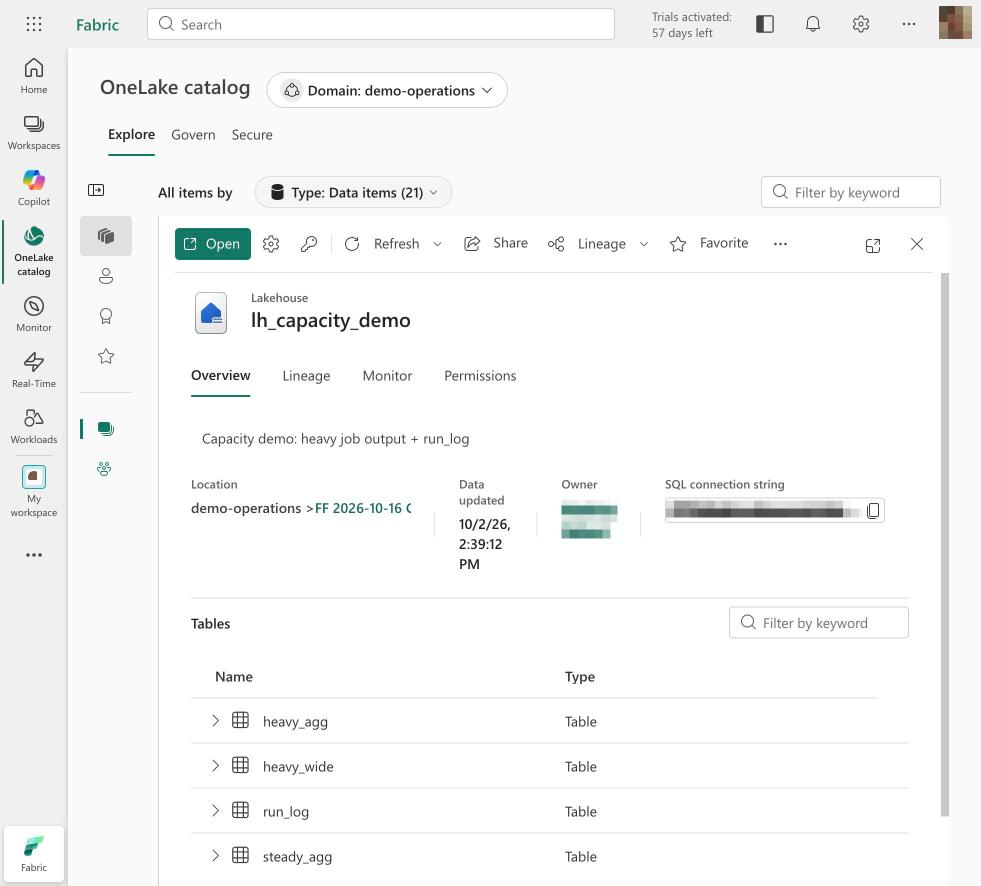
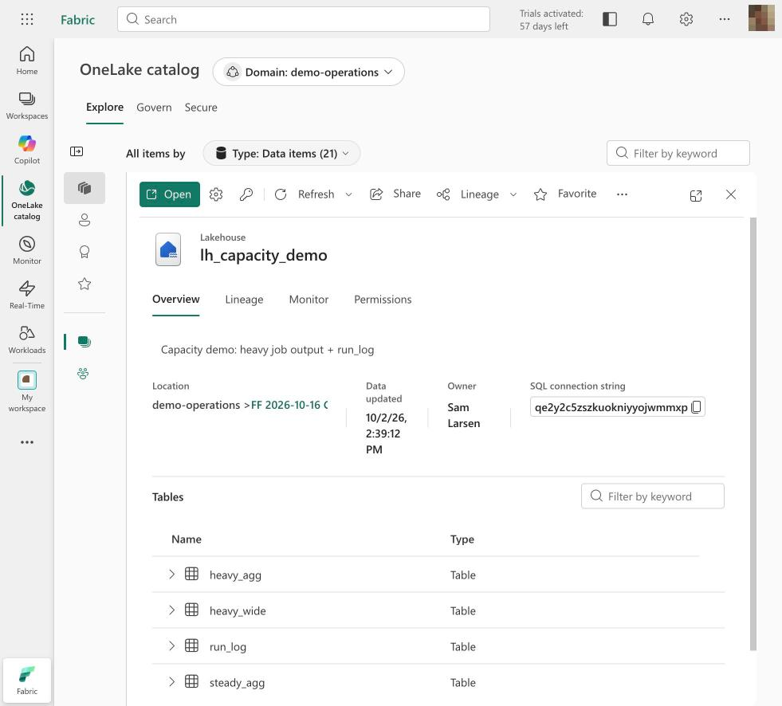
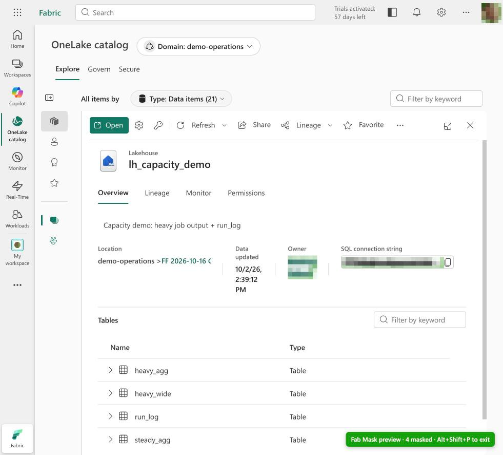

# Fab Mask

[](https://github.com/TheTrustedAdvisor/fab-mask/actions/workflows/ci.yml)
[](https://github.com/TheTrustedAdvisor/fab-mask/releases/latest)
[](LICENSE)

Browser extension for **Chrome, Edge and Firefox** that hides sensitive information in the **Microsoft
Fabric portal** (`app.fabric.microsoft.com`, including Power BI) – for demos, screen sharing, screenshots and
recordings.

Inspired by [clarkio/azure-mask](https://github.com/clarkio/azure-mask) ("Az Mask") for the Azure portal.

## Why Fab Mask?

The Fabric portal surfaces tenant-specific metadata throughout its UI: workspace, item, tenant and
capacity **GUIDs**, **SQL analytics endpoints** and warehouse connection strings, **OneLake / ABFS
paths**, **XMLA endpoints**, data source references, **UPNs** and the **display names** of owners,
admins and the signed-in user. As soon as the portal is shown outside the tenant's trust boundary –
a customer workshop, a conference session, a recorded tutorial, a support call, a screenshot in
documentation – this metadata is disclosed. It is personal data in the GDPR sense, reveals customer
and project context, and hands out exactly the identifiers needed to address a workspace or
endpoint directly.

The usual mitigations do not scale: dedicated demo tenants drift from reality, manual redaction in
post-production is slow and error-prone, and live sessions cannot be redacted after the fact.

**Fab Mask moves redaction into the rendering layer of the browser:**

- **Client-side and read-only** – detection runs locally on the rendered DOM; nothing is sent
  anywhere and nothing in the tenant, workspace or item is modified.
- **Pattern- and context-based** – regex detection for identifiers, endpoints and secrets, plus
  structural selectors for user and owner fields; person names are learned from those fields and
  masked everywhere else.
- **Real time** – a synchronous `MutationObserver` masks new content before the next paint,
  including virtualized lists, Monaco editors and the cross-origin workload frames (notebooks,
  lakehouse explorer, pipelines).
- **Presentation-grade output** – pixelate, blur, redact, or deterministic **fake data** that keeps
  demos readable (same person → same fake name, same ID → same fake ID).

Typical scenarios: customer demos and proofs of concept on production-like tenants, partner and
conference presentations, training and video content, support and troubleshooting sessions, and
screenshots for documentation, blog posts or tickets.

| Without Fab Mask | Pixelate (default) |
|---|---|
|  |  |
| **Fake data** | **Preview mode** |
|  |  |

<sub>The OneLake catalog of a Fabric demo tenant: owner, SQL connection string and profile picture are
masked. In fake-data mode the owner becomes a consistent fake person and the endpoint a fake host.</sub>

## Installation

| Option | For | Guide |
|---|---|---|
| **Load unpacked** (ZIP from the release) | Individuals, right away | [below](#quick-start-load-unpacked) |
| **Enterprise policy** (signed CRX, auto-update) | IT / managed devices (Intune, GPO, Jamf) | [docs/installation.md](docs/installation.md#enterprise-deployment-via-policy) |
| **Firefox** (`fab-mask-<version>-firefox.zip`) | Firefox 142+ | [docs/installation.md](docs/installation.md#firefox) |
| **Safari** (build from source, preview) | macOS with Xcode | [docs/installation.md](docs/installation.md#safari-macos-build-from-source) |

> On Windows and macOS, Chrome and Edge do not allow installing `.crx` files from outside their
> stores by double-click. For individuals, "Load unpacked" is the direct way.

### Quick start: load unpacked

1. Download the latest **`fab-mask-<version>.zip`** from the [releases page](https://github.com/TheTrustedAdvisor/fab-mask/releases/latest) and unzip it into a permanent folder.
2. Open **Chrome:** `chrome://extensions` · **Edge:** `edge://extensions`.
3. Turn on **Developer mode** → **Load unpacked** → select the unzipped folder.
4. Reload open Fabric tabs.

Details, updates and troubleshooting: [docs/installation.md](docs/installation.md).

## What gets masked?

| Category | Default | Examples |
|---|---|---|
| IDs (GUIDs) | on | Workspace, item, tenant and capacity IDs – also inside text and URLs |
| E-mail addresses / UPNs | on | Owners, access lists, guest accounts (`…#EXT#@…`) |
| Endpoints & connection strings | on | SQL endpoints (`*.datawarehouse.fabric.microsoft.com`), OneLake/`abfss://` paths, XMLA (`powerbi://…`), KQL URIs, data sources such as `Extension{"extensionDataSourcePath":"https://org.crm4.dynamics.com"}`, SharePoint, Databricks, Snowflake … |
| Keys & tokens | on | `AccountKey=`, SAS `sig=`, `Password=`, JWTs, storage keys |
| Signed-in user | on | Avatar, name/e-mail/tenant in the account menu, "Owner" columns, OneLake catalog owner, domain admins, workspace image |
| Learned person names | on | Names from owner/admin fields are learned and masked **everywhere** (descriptions, lineage, search …) |
| Workspace names | off | Workspace title, navigation, workspace list, "Location" in the OneLake catalog |
| IP addresses | off | IPv4 (gateways, firewall rules) |
| Custom terms | – | Customer, tenant, project or person names (whole words) |
| Custom CSS selectors | – | Added directly on the page with the **element picker** |

Also covered: **notebooks** (separate frame on `pbides.powerbi.com`, including code cells and outputs),
the **lakehouse explorer** (`pbilhe.powerbi.com`), **pipelines** (`pbidpe.powerbi.com`) and the
**OneLake catalog**.

### Usage


| Shortcut | Action |
|---|---|
| **Alt+Shift+M** | Masking on/off (badge "OFF") |
| **Alt+Shift+B** | **Curtain**: instantly cover all Fabric tabs with a neutral overlay (badge "❚❚") |
| **Alt+Shift+P** | **Preview mode**: outline everything that is masked, with a counter (badge "✓") |
| **Alt+Shift+F** | **Presentation mode**: full screen – the address bar with workspace and item IDs disappears from your screen share – and masking on, optionally with a profile |

- **Right-click** on a Fabric page: *"Fab Mask: always hide “…”"* for selected text (becomes a custom
  term) or *"Fab Mask: always hide this element"* (becomes a custom selector)

- **Profiles**: *Customer demo*, *Recording (fake data)*, *Screenshots (redact)*, *Internal training* –
  or save your own on the options page
- **Modes**: **Pixelate** (mosaic, default), **Blur**, **Fake data** (plausible, consistent replacement
  values – same person ⇒ same fake name) or **Redact**
- **Mask tooltips**: native hover tooltips no longer reveal names or e-mails
- The **tab title** is cleaned as well
- **Pick element**: click in the popup, then on any element – it stays masked from then on
- **Options page**: custom terms & selectors, profiles, list of learned names (remove individually or
  forget all)
- **Send feedback** (popup and options page): opens a pre-filled GitHub issue with version, browser
  and mode only – no page URLs, custom terms or names
- Changes apply **instantly**, no reload · UI in English and German

## Permissions & privacy

- Permissions: `storage` and `contextMenus` (for the right-click entries). No `tabs`, no `scripting`,
  no host permissions beyond the content-script matches.
- The extension sends **no data** anywhere – no telemetry, no network requests.
- Settings, profiles and **learned person names** are stored locally only (`chrome.storage.local`) and
  intentionally **not** synced, so customer or person names never end up in your Google/Microsoft
  account. Learned names can be reviewed and deleted on the options page.
- Fake values are salted per installation, so they cannot be checked against guessed originals.
- No code runs in the page's JavaScript context; the extension does not modify any page APIs.

See [PRIVACY.md](PRIVACY.md).

## Limitations

- The **address bar** (which contains workspace and item IDs) cannot be changed by any extension –
  use **presentation mode** (Alt+Shift+F), which hides it via full screen, or share only the window
  content.
- Content drawn on a **canvas** (e.g. report visuals) is not covered.
- Person names are recognized via owner/profile fields, learned names or **custom terms**.
- Custom terms and selectors apply as soon as the settings are loaded (milliseconds after page start,
  long before the portal renders content).
- Pixelate and blur reliably hide content from screen-share viewers. For published screenshots of
  highly sensitive values, **Redact** is the safest choice, since mosaics of known fonts can in theory
  be reconstructed.
- Fake data replaces the text visually; copy & paste still copies the original.
- The portal markup changes constantly. If something slips through: use the element picker and please
  open an [issue](https://github.com/TheTrustedAdvisor/fab-mask/issues) – **without** real data in
  screenshots.

**Always double-check before sharing your screen.** The extension is an aid, not a guarantee.

## Development

```bash
npm install
npx playwright install chromium webkit   # once, for E2E tests and screenshots
npm test                          # unit and DOM tests (node:test + jsdom)
npm run test:e2e                  # end-to-end with the real extension in Chromium (incl. a perf test)
npm run lint:firefox              # Mozilla's add-on linter on the Firefox build
npm run test:e2e:firefox          # smoke test in a real Firefox (FIREFOX_PATH=…; runs in CI)
npm run build:safari              # Safari app via Apple's converter + Xcode (macOS only)
npm run release:safari            # signed App Store build + upload (APPLE_TEAM_ID=…, see docs/publishing-safari.md)
npm run lint
npm run build                     # dist/fab-mask-<version>.zip + -firefox.zip (local; dist/ is recreated each build)
npm run build:signed              # plus signed CRX + updates.xml (needs the signing key)
npm run screenshots               # regenerate docs/images
```

Official packages are built by CI and attached to the
[GitHub releases](https://github.com/TheTrustedAdvisor/fab-mask/releases) – `dist/` is just a local,
git-ignored build folder.

The E2E tests serve Fabric-like fixtures on the real host names (requests are intercepted, no network
access).

### Architecture

```
src/
  manifest.json
  shared/settings.js        Settings model, storage, profiles, learned names, message types
  shared/detector.js        Regex detection per category (bounded, ReDoS-tested), match kinds
  shared/fake.js            Deterministic, salted fake values (names, GUIDs, e-mails, hosts …)
  shared/feedback.js        Pre-filled GitHub issue URL with non-sensitive diagnostics
  shared/styles.js          CSS generation, selectors for user/person/workspace fields
  content/masker.js         Content script: MutationObserver, inputs, tooltips, shadow DOM, title,
                            fake overlays, curtain, preview badge, name learning
  content/picker.js         Element picker + selector generation
  background/service-worker.js   Shortcuts, badge, picker coordination, learned-name merging
  popup/, options/          UI
```

Elements whose **direct text** (or input value, or whole Monaco editor line) matches a pattern get the
`data-fabric-mask` attribute; an injected stylesheet pixelates them. In fake-data mode the element also
gets `data-fabric-fake`, whose value is laid over the (now invisible) original text via `::after` – the
page's own text is never modified. The MutationObserver processes changes synchronously before the
next paint, so new content never flashes unmasked. Text nodes are never touched, which keeps Angular
and Monaco stable.

### Releasing

1. Bump the version in `package.json` **and** `src/manifest.json`, update `CHANGELOG.md`.
2. `git tag vX.Y.Z && git push --tags`
3. The [release workflow](.github/workflows/release.yml) tests, builds the ZIP, signed CRX and
   `updates.xml` and publishes them as a GitHub release. Browsers installed via policy update
   automatically.

## Author

Fab Mask is built by **Matthias Falland**.

- 🌐 [fabricperiodictable.com](https://www.fabricperiodictable.com)
- 💼 [LinkedIn: matthias-falland](https://www.linkedin.com/in/matthias-falland)
- 🐙 [GitHub: TheTrustedAdvisor](https://github.com/TheTrustedAdvisor)
- ▶️ [YouTube: TheTrustedAdvisor](https://www.youtube.com/@TheTrustedAdvisor)

Feedback and ideas are welcome – use **Send feedback** in the extension or open an
[issue](https://github.com/TheTrustedAdvisor/fab-mask/issues).

## License

[MIT](LICENSE) © Matthias Falland. "Microsoft Fabric" and "Power BI" are trademarks of Microsoft
Corporation; this project is not affiliated with Microsoft.
