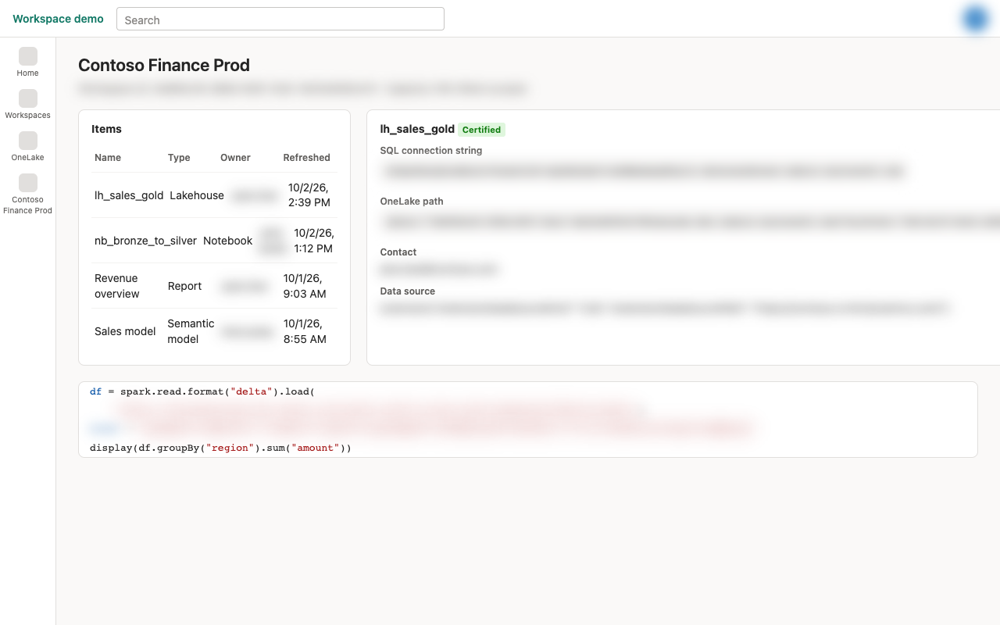
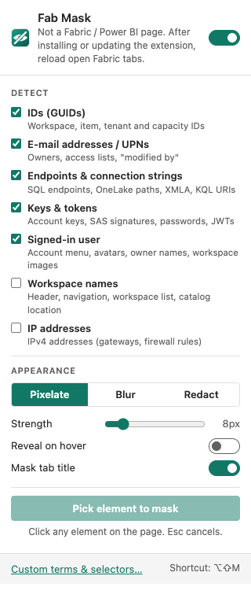

# Fab Mask

[](https://github.com/TheTrustedAdvisor/fab-mask/actions/workflows/ci.yml)
[](https://github.com/TheTrustedAdvisor/fab-mask/releases/latest)
[](LICENSE)

Browser-Erweiterung für **Chrome und Edge**, die sensible Informationen im **Microsoft Fabric-Portal**
(`app.fabric.microsoft.com`, inkl. Power BI) unscharf macht oder schwärzt – für Demos,
Bildschirmfreigaben, Screenshots und Aufzeichnungen.

Inspiriert von [clarkio/azure-mask](https://github.com/clarkio/azure-mask) („Az Mask“) für das Azure-Portal.

| Ohne Fab Mask | Mit Fab Mask |
|---|---|
|  |  |

<sub>Screenshots einer Demo-Seite mit erfundenen Daten ([docs/demo](docs/demo/workspace.html)).</sub>

## Installation

| Weg | Für wen | Anleitung |
|---|---|---|
| **Entpackt laden** (ZIP aus dem Release) | Einzelpersonen, sofort | [unten](#schnellstart-entpackt-laden) |
| **Unternehmensrichtlinie** (signiertes CRX, Auto-Update) | IT / verwaltete Geräte (Intune, GPO, Jamf) | [docs/installation.md](docs/installation.md#unternehmensweit-per-richtlinie) |
| **Chrome Web Store / Edge Add-ons** | alle | in Vorbereitung – siehe [docs/store-listing.md](docs/store-listing.md) |

> Chrome und Edge erlauben unter Windows und macOS keine Installation von `.crx`-Dateien per
> Doppelklick außerhalb der Stores. Für Einzelpersonen ist daher „Entpackt laden“ der direkte Weg.

### Schnellstart: entpackt laden

1. Neueste **`fab-mask-<version>.zip`** von der [Release-Seite](https://github.com/TheTrustedAdvisor/fab-mask/releases/latest) herunterladen und in einen dauerhaften Ordner entpacken.
2. **Chrome:** `chrome://extensions` · **Edge:** `edge://extensions` öffnen.
3. **Entwicklermodus** einschalten → **Entpackte Erweiterung laden** → den entpackten Ordner wählen.
4. Offene Fabric-Tabs neu laden.

Details, Updates und Fehlerbehebung: [docs/installation.md](docs/installation.md).

## Was wird maskiert?

| Kategorie | Standard | Beispiele |
|---|---|---|
| IDs (GUIDs) | an | Workspace-, Item-, Tenant-, Capacity-IDs – auch mitten im Text oder in URLs |
| E-Mail-Adressen / UPNs | an | Besitzer, Zugriffslisten, Gastkonten (`…#EXT#@…`) |
| Endpunkte & Connection Strings | an | SQL-Endpunkte (`*.datawarehouse.fabric.microsoft.com`), OneLake-/`abfss://`-Pfade, XMLA (`powerbi://…`), KQL-URIs, Datenquellen wie `Extension{"extensionDataSourcePath":"https://org.crm4.dynamics.com"}`, SharePoint, Databricks, Snowflake … |
| Schlüssel & Tokens | an | `AccountKey=`, SAS-`sig=`, `Password=`, JWTs, Storage-Keys |
| Angemeldeter Benutzer | an | Avatar, Name/E-Mail/Tenant im Kontomenü, Spalte „Owner“, Owner im OneLake-Katalog, Admins in Domänen, Workspace-Bild |
| Workspace-Namen | aus | Workspace-Titel, Navigation, Workspace-Liste, „Location“ im OneLake-Katalog |
| IP-Adressen | aus | IPv4 (Gateways, Firewall-Regeln) |
| Eigene Begriffe | – | Kunden-, Tenant-, Projekt- oder Personennamen (ganze Wörter) |
| Eigene CSS-Selektoren | – | per **Element-Picker** direkt auf der Seite hinzufügen |

Abgedeckt sind auch **Notebooks** (eigener Frame auf `pbides.powerbi.com`, inkl. Code-Zellen und
Ausgabetabellen), der **Lakehouse-Explorer** (`pbilhe.powerbi.com`), **Pipelines**
(`pbidpe.powerbi.com`) und der **OneLake-Katalog**.

### Bedienung



- **Ein/Aus** per Popup oder **Alt+Shift+M** (Badge zeigt „OFF“)
- Modus **Pixel** (Mosaik, Standard), **Unscharf** oder **Schwärzen**; Stärke einstellbar;
  optional „Bei Mouseover anzeigen“
- **Tab-Titel** wird ebenfalls bereinigt
- **Element auswählen**: im Popup klicken, dann auf ein Element der Seite – es bleibt künftig maskiert
- **Eigene Begriffe & Selektoren** auf der Optionsseite
- Änderungen wirken **sofort**, ohne Neuladen
- Deutsch und Englisch

<br clear="right">

## Berechtigungen & Datenschutz

- Einzige Berechtigung: `storage`. Kein `tabs`, kein `scripting`, keine weiteren Host-Berechtigungen.
- Die Erweiterung sendet **keine Daten** irgendwohin – keine Telemetrie, keine Netzwerkzugriffe.
- Einstellungen liegen nur lokal (`chrome.storage.local`), bewusst **nicht** synchronisiert,
  damit Kunden- oder Personennamen nicht ins Google-/Microsoft-Konto wandern.

Siehe [PRIVACY.md](PRIVACY.md).

## Einschränkungen

- Die **Adressleiste** (enthält Workspace- und Item-IDs) kann keine Erweiterung verändern –
  nur den Fensterinhalt oder im Vollbild (F11) teilen.
- **Native Tooltips** (`title`-Attribute) und auf **Canvas** gezeichnete Inhalte
  (z. B. Report-Visuals) werden nicht erfasst.
- Personennamen werden über die Owner-/Profil-Selektoren oder **eigene Begriffe** erkannt.
- Eigene Begriffe/Selektoren greifen, sobald die Einstellungen geladen sind (wenige Millisekunden
  nach Seitenstart, lange bevor das Portal Inhalte rendert).
- Das Portal-Markup ändert sich laufend. Rutscht etwas durch: Element-Picker verwenden und gern
  ein [Issue](https://github.com/TheTrustedAdvisor/fab-mask/issues) eröffnen – **ohne** echte Daten im Screenshot.

- Pixel- und Unscharf-Modus verbergen Inhalte zuverlässig für Zuschauer einer Bildschirmfreigabe.
  Für veröffentlichte Screenshots mit besonders kritischen Werten ist **Schwärzen** die sicherste Wahl,
  da Mosaike bei bekannter Schrift theoretisch rekonstruiert werden können.

**Vor jeder Bildschirmfreigabe selbst prüfen.** Die Erweiterung ist eine Hilfe, keine Garantie.

## Entwicklung

```bash
npm install
npx playwright install chromium   # einmalig, für E2E-Tests und Screenshots
npm test                          # Unit- und DOM-Tests (node:test + jsdom)
npm run test:e2e                  # End-to-End mit der echten Erweiterung in Chromium
npm run lint
npm run build                     # dist/fab-mask-<version>.zip
npm run build:signed              # zusätzlich signiertes CRX + updates.xml (Schlüssel nötig)
npm run screenshots               # docs/images neu erzeugen
```

Die E2E-Tests liefern Fabric-ähnliche Fixtures unter den echten Hostnamen aus (Requests werden
abgefangen, kein Netzwerkzugriff).

### Aufbau

```
src/
  manifest.json
  shared/settings.js        Einstellungsmodell, Storage, Nachrichtentypen
  shared/detector.js        Regex-Erkennung je Kategorie (linear begrenzt, ReDoS-getestet)
  shared/styles.js          CSS-Generierung, Selektoren für Benutzer/Workspaces
  content/masker.js         Content Script: MutationObserver, Inputs, Shadow DOM, Titel
  content/picker.js         Element-Picker + Selektor-Generierung
  background/service-worker.js   Tastenkürzel, Badge, Picker-Koordination
  popup/, options/          Oberfläche
```

Elemente, deren **direkter Text** (oder Input-Wert, oder ganze Monaco-Editorzeile) einem Muster
entspricht, erhalten das Attribut `data-fabric-mask`; ein injiziertes Stylesheet macht sie
unscharf. Der MutationObserver verarbeitet Änderungen synchron vor dem nächsten Rendern, sodass
neue Inhalte nicht unmaskiert aufblitzen. Textknoten werden nie verändert – das hält Angular und
Monaco stabil.

### Release

1. Version in `package.json` **und** `src/manifest.json` erhöhen, `CHANGELOG.md` ergänzen.
2. `git tag vX.Y.Z && git push --tags`
3. Der Workflow [release.yml](.github/workflows/release.yml) testet, baut ZIP, signiertes CRX und
   `updates.xml` und veröffentlicht sie als GitHub-Release. Per Richtlinie installierte Browser
   aktualisieren sich automatisch.

## Lizenz

[MIT](LICENSE) © Matthias Falland. „Microsoft Fabric“ und „Power BI“ sind Marken der Microsoft
Corporation; dieses Projekt ist nicht mit Microsoft verbunden.
